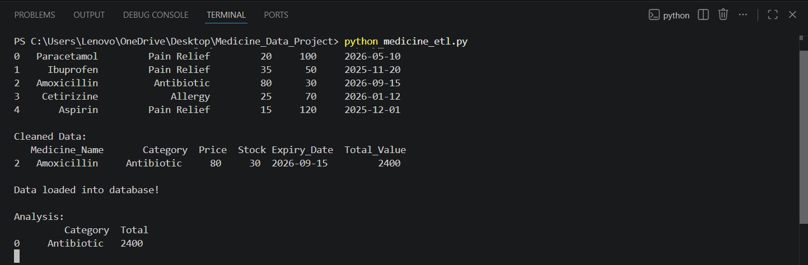
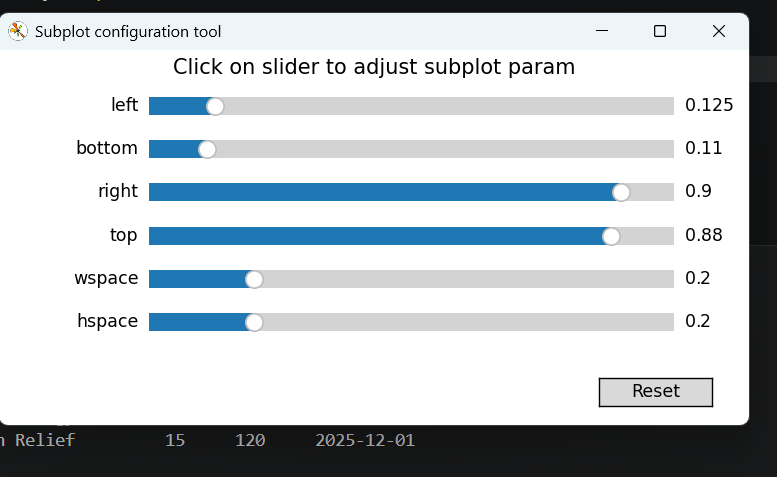
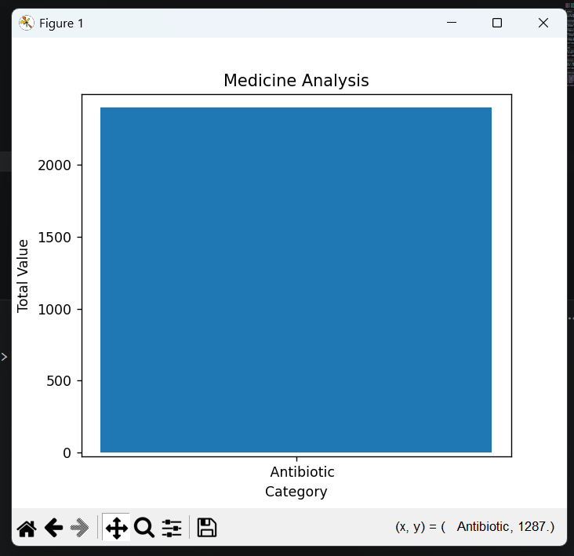

# Medicine Data Processing System

## Overview
A Python-based ETL pipeline designed to process and analyze medicine inventory data.

## Features
- Extracts medicine data from CSV files
- Cleans and transforms data using Pandas
- Calculates total inventory value
- Stores processed data into SQLite database
- Performs category-wise inventory analysis

## Technologies Used
- Python
- Pandas
- SQLite
- ETL Pipeline

## Project Workflow

Data Extraction → Data Cleaning → Data Transformation → Database Loading → Analysis

## Output Screenshots

### ETL Pipeline Output

### Category Analysis

### Medicine Analysis

